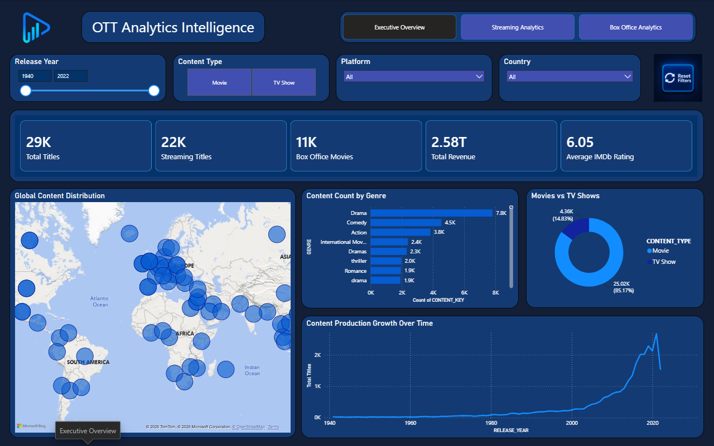
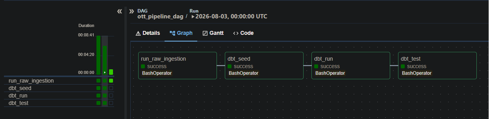
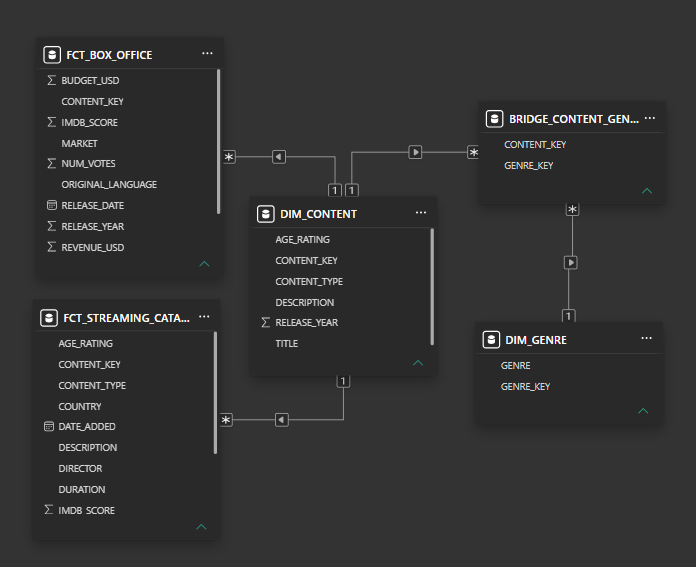
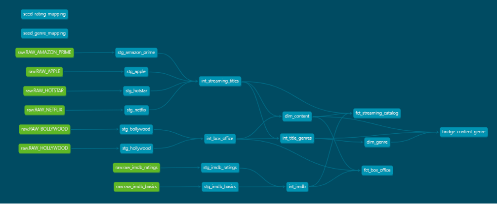

# 1. Project Name

**OTT Analytics Intelligence Platform**

---

# 2. Project Presentation

The **OTT Analytics Intelligence Platform** is an end-to-end data engineering and business intelligence project that collects, transforms, stores, and visualizes streaming platform and box office data.

It is designed for data analysts and decision-makers who need reliable insights about content catalogs, financial performance, platform distribution, and audience ratings.

The main objective of this project is to automate the complete data pipeline, from raw data ingestion to interactive Power BI dashboards, using modern data engineering technologies.

---

# 3. Problem Statement

Streaming platforms, IMDb datasets, and box office data are collected from multiple sources with different structures, formats, and naming conventions.

This makes it difficult to compare platforms, analyze content performance, and generate accurate business insights.

The solution proposed is an automated data pipeline that extracts, cleans, standardizes, and integrates these datasets into a centralized Snowflake data warehouse. The transformed data is then modeled using a dimensional architecture and presented through interactive Power BI dashboards.

---

# 4. Main Features

- Extract streaming platform, IMDb, and box office datasets from multiple sources.
- Clean and standardize heterogeneous datasets using dbt transformations.
- Build a dimensional data warehouse using fact tables, dimension tables, and bridge tables.
- Automate the complete workflow using Apache Airflow orchestration.
- Validate transformed data using dbt tests and documentation.
- Visualize business insights through interactive Power BI dashboards.

---

# 5. Technologies Used

| Technology     | Usage in the Project                                                                         |
| -------------- | -------------------------------------------------------------------------------------------- |
| Python         | Develops the ingestion pipeline to extract raw datasets and load them into Snowflake.        |
| Snowflake      | Stores the data warehouse layers including RAW, STAGING, INTERMEDIATE, and MARTS schemas.    |
| dbt            | Performs data cleaning, transformation, testing, and dimensional modeling.                   |
| SQL            | Implements data transformations, joins, aggregations, and business logic inside dbt models.  |
| Apache Airflow | Automates and orchestrates the execution of ingestion and transformation workflows.          |
| Docker         | Provides a consistent and isolated environment for running Airflow and project dependencies. |
| Power BI       | Creates interactive dashboards for analyzing streaming and box office performance.           |
| Git & GitHub   | Manage source code versioning and project development.                                       |

---

# 6. Installation and Launch

## 6.1 Prerequisites

To use this project, you must have:

- Python 3.10 or later
- Git
- Docker Desktop
- Snowflake account
- Power BI Desktop
- Visual Studio Code (recommended)

---

## 6.2 Clone the Repository

```bash
git clone https://github.com/yup-py/ott-streaming-box-office-analytics.git
```

---

## 6.3 Open the Project Folder

```bash
cd ott-streaming-box-office-analytics
```

---

## 6.4 Install Dependencies

Create and activate a Python virtual environment.

Windows:

```bash
python -m venv venv
venv\Scripts\activate
```

Linux / macOS:

```bash
python3 -m venv venv
source venv/bin/activate
```

Install the required dependencies:

```bash
pip install -r requirements.txt
```

---

## 6.5 Environment Variables

Create a `.env` file in the project root.

Add your Snowflake connection information:

```env
SNOWFLAKE_ACCOUNT=
SNOWFLAKE_USER=
SNOWFLAKE_PASSWORD=
SNOWFLAKE_DATABASE=
SNOWFLAKE_WAREHOUSE=
SNOWFLAKE_ROLE=
```

Never publish credentials, passwords, or sensitive information to GitHub.

---

## 6.6 Launch the Project

### Start Apache Airflow

Run Docker containers:

```bash
docker compose up -d
```

Verify that the containers are running:

```bash
docker ps
```

---

### Run Data Ingestion

Execute the extraction and loading pipeline:

```bash
python ingestion/extract_load.py
```

---

### Run dbt Transformations

Navigate to the dbt directory:

```bash
cd dbt
```

Run the transformation models:

```bash
dbt run
```

---

### Run Data Quality Tests

Execute dbt tests:

```bash
dbt test
```

---

## 6.7 Open the Project

After launching the project:

### Apache Airflow

Open:

```
http://localhost:8080
```

The Airflow interface allows monitoring and managing pipeline execution.

---

### Power BI Dashboard

Open the Power BI report:

```
powerbi/OTT_Analytics_Intelligence_Dashboard.pbix
```

Refresh the connection using your Snowflake credentials to load the latest data.

---

### Point of Attention

Before running or sharing the project:

- Verify that all installation commands work correctly.
- Ensure Docker services are running before executing Airflow workflows.
- Check that Snowflake credentials are configured correctly.
- Run dbt tests before using the dashboards.
- Never publish passwords, API keys, or database credentials.

---

# 7. Screenshots

## Screenshot 1

### Title

```
Power BI Executive Overview Dashboard
```

### Image



### Explanation

This screenshot shows the main Power BI dashboard used to analyze OTT content catalogs. It displays key performance indicators, platform comparisons, content growth trends, and IMDb rating analysis.

---

## Screenshot 2

### Title

```
Apache Airflow Pipeline Execution
```

### Image



### Explanation

This screenshot shows the Airflow workflow responsible for orchestrating the data pipeline, including data ingestion, Snowflake loading, and dbt transformation tasks.

---

## Screenshot 3

### Title

```
Snowflake Data Warehouse Architecture
```

### Image



### Explanation

This screenshot shows the Snowflake data warehouse structure containing the different data layers used by the project, from raw data to analytical marts.

---

## Screenshot 4

### Title

```
dbt Model Lineage
```

### Image



### Explanation

This screenshot shows the relationships between dbt models and illustrates the transformation flow from staging models to final analytical tables.

---

# 8. Personal Contribution

My main contribution focused on designing and developing the complete end-to-end data engineering and business intelligence solution.

I worked on the following parts of the project:

- Developing the Python ingestion pipeline to extract streaming, IMDb, and box office datasets and load them into Snowflake.
- Designing the Snowflake data warehouse architecture with RAW, STAGING, INTERMEDIATE, and MARTS layers.
- Creating dbt models for data cleaning, transformation, testing, and dimensional modeling.
- Building fact tables, dimension tables, and bridge tables following Kimball star schema principles.
- Writing SQL transformations to standardize data, handle relationships, and prepare analytical datasets.
- Configuring Apache Airflow workflows to automate pipeline execution.
- Setting up Docker environments to manage project dependencies and services.
- Designing Power BI dashboards to present business insights about streaming platforms, content performance, and box office analysis.
- Documenting the project structure, pipeline workflow, and technical implementation.

I was responsible for the complete data lifecycle, from raw data ingestion to the final analytical dashboards.

---

# 9. Challenges Encountered

## Challenge 1: Integrating Data From Multiple Streaming Platforms

### Problem Encountered

The streaming datasets came from different platforms and contained inconsistent structures, column names, genres, and rating systems.

For example, the same type of information could be represented differently depending on the source, making direct integration difficult.

### Research / Tests

I analyzed the different source datasets and compared their schemas to identify common attributes such as title, release year, platform, genre, country, and rating.

I tested different transformation approaches to determine the best way to standardize the data before integration.

### Solution

I created separate dbt staging models for each source dataset and applied transformation logic to rename columns, clean values, and standardize formats.

Mapping tables were also created to normalize genres and age ratings across different platforms.

### What I Learned

This challenge improved my understanding of data cleaning, schema standardization, and the importance of creating a strong staging layer before performing analytical transformations.

### Final Text

I encountered the challenge of integrating datasets coming from multiple streaming platforms with different structures and classification systems.

To understand the issue, I analyzed each dataset and identified differences in column names, formats, genres, and ratings.

I solved this problem by creating dbt staging models and mapping tables that standardized the data before combining it into the data warehouse.

This challenge helped me better understand data integration and transformation techniques used in modern data engineering projects.

---

## Challenge 2: Designing a Star Schema With Many-to-Many Relationships

### Problem Encountered

Some movies and shows belonged to multiple genres, which caused duplicate records when trying to store all information in a single table.

### Research / Tests

I studied dimensional modeling concepts and tested different approaches for handling multi-valued attributes.

I compared storing genres directly in fact tables with using separate relationship tables.

### Solution

I created a dedicated genre dimension and a bridge table between content and genres.

This allowed the project to maintain accurate relationships while avoiding duplicated analytical results.

### What I Learned

I learned how bridge tables are used in dimensional modeling and how they help maintain clean and scalable data warehouse designs.

### Final Text

I encountered difficulties when modeling content that belonged to multiple genres.

To investigate the problem, I studied different dimensional modeling approaches and tested different database structures.

I solved the issue by implementing a bridge table between the content and genre dimensions.

This challenge helped me improve my knowledge of Kimball modeling principles and many-to-many relationships.

---

## Challenge 3: Automating the Pipeline With Airflow and Docker

### Problem Encountered

Running the complete pipeline required coordinating several technologies including Python ingestion, Snowflake loading, dbt transformations, and Airflow scheduling.

Managing dependencies and execution order was challenging.

### Research / Tests

I studied Airflow workflow management and tested different configurations for running pipeline tasks inside Docker containers.

I also investigated environment variables and dependency management issues.

### Solution

I created an Airflow DAG that defines the execution order between ingestion, transformations, and validation steps.

Docker was configured to provide a consistent environment containing the required dependencies.

### What I Learned

This challenge improved my understanding of workflow orchestration, containerization, and the importance of automation in production data pipelines.

### Final Text

I faced challenges when automating the complete data pipeline using Airflow and Docker.

To understand the problem, I tested different configurations and analyzed dependencies between the different project components.

I solved the issue by creating an automated Airflow workflow and configuring Docker to provide a stable execution environment.

This challenge helped me understand how modern data engineering pipelines are managed and automated.

---

# 10. Possible Improvements

In a future version, I could:

- Add more streaming platforms such as Disney+, Hulu, and Max.
- Replace static datasets with real-time APIs for continuous data updates.
- Implement incremental dbt models to improve pipeline performance.
- Deploy the Power BI dashboards to Power BI Service with automatic refresh.
- Add machine learning models to predict content performance and revenue trends.

### Conclusion

These improvements would make the platform more scalable, automated, and capable of providing deeper insights for business users and decision-makers.

---

# 11. Final Checklist

## Presentation

- [X] The project name is clear.
- [X] The project is presented in 3 to 5 lines.
- [X] The target audience is identified.
- [X] The business need is explained.
- [X] The main objective is specified.

## Features

- [X] 3 to 6 main features are described.
- [X] Each feature starts with an action verb.
- [X] Features correspond to real project capabilities.

## Technologies

- [X] Technologies are listed.
- [X] Their role in the project is explained.

## Installation

- [X] Prerequisites are provided.
- [X] Repository cloning instructions are included.
- [X] Installation commands are documented.
- [X] Project access instructions are included.
- [X] No sensitive information is published.

## Screenshots

- [X] At least two screenshots are included.
- [X] Each screenshot has a title.
- [X] Each screenshot has an explanation.

## Contribution

- [X] My contribution is clearly described.
- [X] My responsibilities are identified.
- [X] My work is distinguished from the overall project.

## Challenges

- [X] Challenges are explained.
- [X] Research and tests are described.
- [X] Solutions are presented.
- [X] Lessons learned are highlighted.

## Improvements

- [X] Future improvements are realistic.
- [X] Expected benefits are explained.
